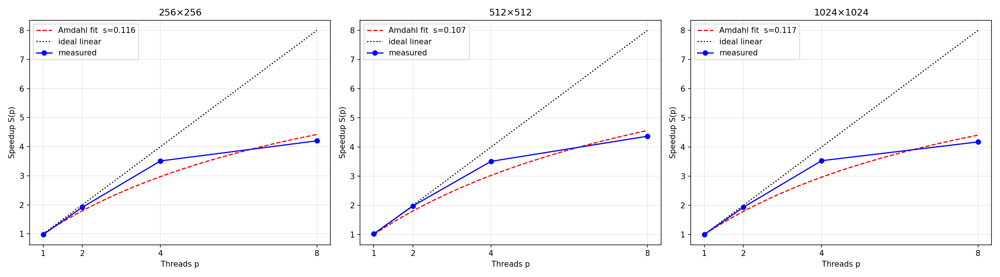
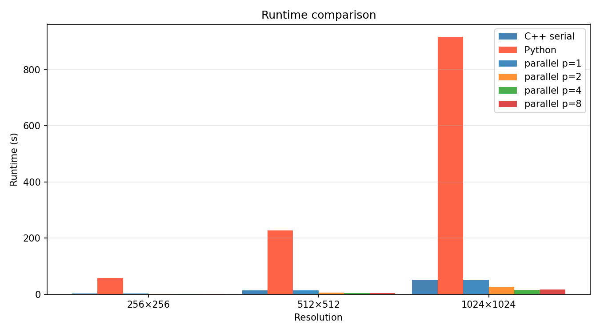
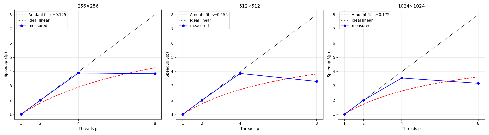

# raytracer-omp
A simple  OpenMP-parallelized ray tracer in C++ - Exercise for the Efficient Computing course at FSU Jena 

## Overview

The ray tracer renders a triangulated 3D scene (ASCII STL) using the Möller–Trumbore intersection algorithm and Lambert diffuse shading. It is implemented in three variants:

- **Serial C++** - single-threaded baseline
- **Parallel C++** - OpenMP-parallelized pixel loop
- **Python reference** - provided reference implementation

## Repository Structure

```
raytracer-omp/
├── include/
│   ├── serial_renderer.hpp
│   ├── parallel_renderer.hpp
│   └── utils/
│       ├── vec3.hpp
│       ├── triangle.hpp
│       ├── scene.hpp
│       └── io.hpp
├── src/
│   └── main.cpp
├── reference/
│   └── SimpleRenderWithSTL.py
├── resources/
│   └── stl/
│       └── test.stl
├── benchmark/
│   ├── benchmark.py
│   ├── plot.py
│   └── results.csv
├── output/
│   ├── serial/
│   ├── parallel/
│   └── reference/
└── CMakeLists.txt
```

## Build

```bash
cmake -S . -B build
cmake --build build -j
```

Requires a C++20 compiler and OpenMP. On macOS install libomp via Homebrew:

```bash
brew install libomp
```

## Usage

```bash
# Serial
./build/raytracer_serial resources/stl/test.stl [width] [height]

# Parallel
OMP_NUM_THREADS=4 ./build/raytracer_parallel resources/stl/test.stl [width] [height]

# Python 
python3 reference/SimpleRenderWithSTL.py resources/stl/test.stl [width] [height]
```

Default resolution is 600×600. Output is written to `output/serial/output.ppm`, `output/parallel/output.ppm` and `output/reference/output.ppm`.

## Render Output


## Benchmark

```bash
python benchmark/benchmark.py --sizes 256 512 1024 --threads 1 2 4 8
python benchmark/plot.py 
```

## Results
 
### macOS (Apple M2, 8 cores)
 
 



#### 256×256
 
| p   | T(p) best | T(p) mean | S(p)  | E(p)  |
| --- | --------- | --------- | ----- | ----- |
| 1   | 1.3640s   | 1.3679s   | 0.978 | 0.978 |
| 2   | 0.6972s   | 0.6991s   | 1.914 | 0.957 |
| 4   | 0.3803s   | 0.3824s   | 3.508 | 0.877 |
| 8   | 0.3177s   | 0.3327s   | 4.199 | 0.525 |
 
#### 512×512
 
| p   | T(p) best | T(p) mean | S(p)  | E(p)  |
| --- | --------- | --------- | ----- | ----- |
| 1   | 5.2871s   | 5.2962s   | 1.023 | 1.023 |
| 2   | 2.7333s   | 2.7415s   | 1.979 | 0.990 |
| 4   | 1.5419s   | 1.5820s   | 3.509 | 0.877 |
| 8   | 1.2382s   | 1.2520s   | 4.369 | 0.546 |
 
#### 1024×1024
 
| p   | T(p) best | T(p) mean | S(p)  | E(p)  |
| --- | --------- | --------- | ----- | ----- |
| 1   | 21.1215s  | 21.1749s  | 0.998 | 0.998 |
| 2   | 10.9017s  | 10.9042s  | 1.934 | 0.967 |
| 4   | 5.9718s   | 6.1254s   | 3.530 | 0.882 |
| 8   | 5.0517s   | 5.1391s   | 4.173 | 0.522 |
 
---
 
### Raspberry Pi 5 (Cortex-A76, 4 cores)
 





#### 256×256
 
| p   | T(p) best | T(p) mean | S(p)  | E(p)  |
| --- | --------- | --------- | ----- | ----- |
| 1   | 3.2084s   | 3.2332s   | 0.998 | 0.998 |
| 2   | 1.6129s   | 1.6144s   | 1.985 | 0.993 |
| 4   | 0.8201s   | 0.8205s   | 3.905 | 0.976 |
| 8   | 0.8309s   | 0.8511s   | 3.854 | 0.482 |
 
#### 512×512
 
| p   | T(p) best | T(p) mean | S(p)  | E(p)  |
| --- | --------- | --------- | ----- | ----- |
| 1   | 12.8056s  | 12.9977s  | 0.999 | 0.999 |
| 2   | 6.4370s   | 6.4476s   | 1.988 | 0.994 |
| 4   | 3.3033s   | 3.5730s   | 3.873 | 0.968 |
| 8   | 3.8616s   | 3.9087s   | 3.313 | 0.414 |
 
#### 1024×1024
 
| p   | T(p) best | T(p) mean | S(p)  | E(p)  |
| --- | --------- | --------- | ----- | ----- |
| 1   | 51.0778s  | 51.2464s  | 1.002 | 1.002 |
| 2   | 25.7275s  | 25.7710s  | 1.990 | 0.995 |
| 4   | 14.4063s  | 15.3139s  | 3.554 | 0.888 |
| 8   | 16.1028s  | 16.2686s  | 3.179 | 0.397 |


## OpenMP Parallelization

The render loop iterates independently over all pixels - each pixel requires only read access to shared scene data and writes to a unique index in the pixel buffer. This offers the opportunity to parallelize the render loop as follows:


```cpp
#pragma omp parallel for collapse(2) schedule(dynamic, 16)
for (int j = 0; j < height; ++j) {
    for (int i = 0; i < width; ++i) { ... }
}
```

`collapse(2)` merges both loops into a single work pool. `schedule(dynamic, 16)` distributes chunks of 16 pixels dynamically across threads, balancing load for scenes with uneven triangle density.

**Variable classification:**
- Shared (read-only): `scene`, `C`, `light`, `forward`, `right`, `actual_up`, `fov`, `aspect`
- Private (loop-local): `i`, `j`, `x`, `y`, `D`, `color`, `r`, `g`, `b`
- Shared (disjoint writes): `pixels` - each thread writes to a unique index

## Amdahl's Law
 
### macOS (Apple M2, 8 cores)
 
Fitting Amdahl's law $S(p) = 1 / (s + (1-s)/p)$ to the measured speedups yields a
consistent serial fraction of approximately $s \approx 0.11$ across all resolutions,
implying a theoretical maximum speedup of $1/s \approx 8.6\text{–}9.3\times$.
 
The measured maximum of $\approx 4.2×$ at $p=8$ falls well short of this bound. The M2 has
4 high-performance and 4 efficiency cores - the efficiency cores are significantly slower,
which reduces effective parallelism and causes the steep drop in efficiency from
$E(4)\approx0.88$ to $E(8)\approx0.52$. The serial fraction is stable across resolutions, suggesting
the bottleneck is structural (OpenMP overhead, thread management) rather than
memory-bandwidth related.
 
### Raspberry Pi 5 (Cortex-A76, 4 cores)
 
On the Pi 5, scaling up to $p=4$ is nearly ideal: $E(4)\approx 0.97$ across all resolutions,
indicating minimal overhead at this thread count. Beyond p=4, performance degrades -
at $p=8$, $T(p=8) > T(p=4)$. The Pi 5 has 4 physical cores; using $p=8$ introduces
OS scheduling overhead with no additional compute resources, making $p=4$ the optimal
thread count on this platform.
 
Notably, the fitted serial fraction increases with resolution - from $s \approx 0.12$
at $256\times256$ to $s \approx 0.17$ at $1024\approx1024$, lowering the theoretical maximum speedup
from $8.0\times$ to $5.8\times$. This suggests memory bandwidth saturation at larger problem sizes:
the Pi 5 has to move significantly more data through its cache hierarchy compared to
the M2, which effectively reduces the parallelizable fraction of the workload.
 
## Default Rendering Parameters
 
| Parameter       | Value           |
| --------------- | --------------- |
| Camera position | (20, −20, 10)   |
| Look-at point   | (0, 0, 3)       |
| Up-vector       | (0, 0, 1)       |
| Light source    | (20, −20, 5)    |
| Field of view   | π/3             |
| Background      | white (1, 1, 1) |